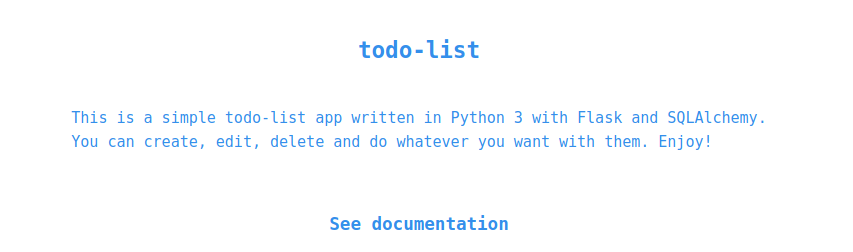
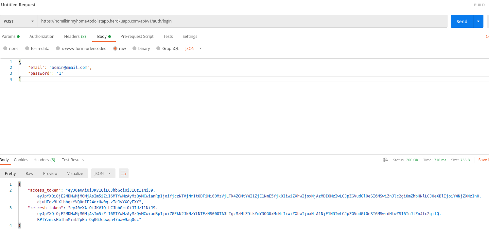
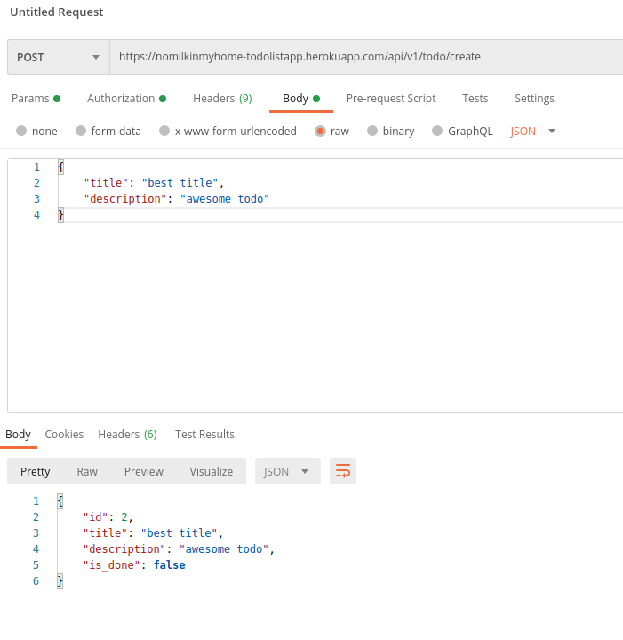
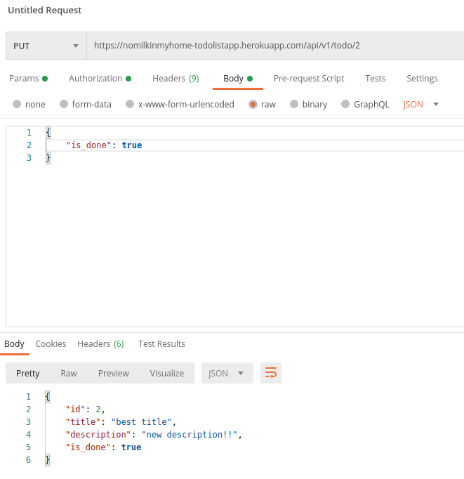

## todo-list

A simple todo-list application written in Python 3 with Flask and SQLAlchemy.

Home page: https://nomilkinmyhome-todolistapp.herokuapp.com/

API docs: https://nomilkinmyhome-todolistapp.herokuapp.com/api/v1



---

### **Database creation**

**In postgresql:**
1. ```CREATE DATABASE todolist_db;```
2. ```CREATE USER todolist_user WITH ENCRYPTED PASSWORD '1';```
3. ```GRANT ALL PRIVILEGES ON DATABASE todolist_db TO todolist_user;```

### **How to run the app**

**In virtual environment:**
1. ```pip install -r requirements-development.txt```
2. ```python manage.py db stamp head```
3. ```CONFIG_FILE=configs/development.cfg python manage.py db upgrade```
4. ```CONFIG_FILE=configs/development.cfg python initialize.py```
5. ```CONFIG_FILE=configs/development.cfg python app.py``` 

### **Some examples via Postman**

**Authorization**

URL: https://nomilkinmyhome-todolistapp.herokuapp.com/api/v1/auth/login




**Todo creation**

URL: https://nomilkinmyhome-todolistapp.herokuapp.com/api/v1/todo/create




**Todo editing**

URL: https://nomilkinmyhome-todolistapp.herokuapp.com/api/v1/todo/1

